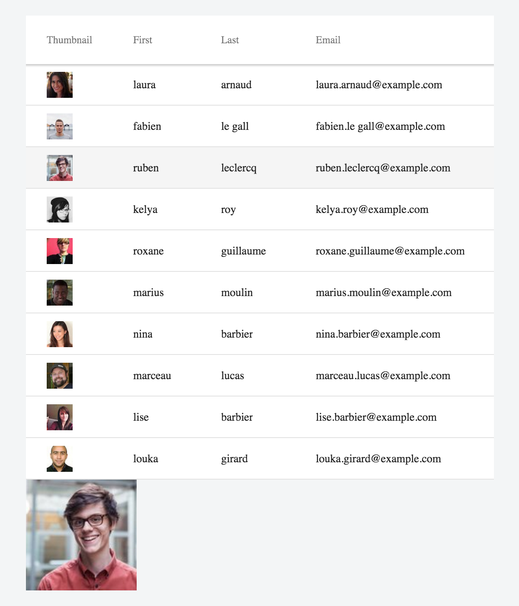

# React Integration

The link:https://facebook.github.io/react/[React] library from Facebook easily integrates with web components.
As long as you import required polyfills and add HTML imports for the elements you are using, you can simply start adding these custom elements to your JSX markup.

ifdef::web[]
====
See also the link:https://facebook.github.io/react/docs/webcomponents.html[Web Components page] in React documentation.
====
endif::web[]

## Grid Example

[[figure.vaadin-grid.react]]
.React integration example using [vaadinelement]#vaadin-grid#

The example consists of two React components: [classname]#UserApp# and [classname]#UserGrid#.
The [classname]#UserGrid# component wraps the [vaadinelement]#vaadin-grid# element and does all necessary initialization to display a list of random users.
As React does not support link:https://facebook.github.io/react/docs/jsx-gotchas.html#custom-html-attributes[custom attributes] on standard elements, [vaadinelement]#vaadin-grid# DOM API cannot be fully utilized in the initialization.
Fortunately, [vaadinelement]#vaadin-grid# also provides corresponding JavaScript APIs.

Selecting an item in the [classname]#UserGrid# is handled by the [classname]#UserApp# component.
The selection is handled by displaying the photo of the selected user below the [vaadinelement]#vaadin-grid#.

The code below can be run and forked as a JSFiddle at https://jsfiddle.net/pw1nLaL8/2/.

[source, javascript]
----
// Create the UserGrid class
var UserGrid = React.createClass({
  render: function(){
    return (
      '<vaadin-grid></vaadin-grid>';
    )
  },

  componentDidMount: function() {
    var _this = this;
    var vGrid = ReactDOM.findDOMNode(this);

    // Let the mounted <vaadin-grid> upgrade
    (function wait() {
      if (vGrid.selection) {
        // Assign the data source
        vGrid.items = _this.items;
        vGrid.size = 1000;

        // Bind selection listener
        vGrid.addEventListener("selected-items-changed", _this.onRowSelect);

        var pictureRenderer = function(cell) {
          cell.element.innerHTML = "</img>";
        };

        // Define columns
        vGrid.columns = [
          {name: "user.picture.thumbnail", width: 100, renderer: pictureRenderer},
          {name: "user.name.first"},
          {name: "user.name.last"},
          {name: "user.email"},
        ];

      } else {
        setTimeout(wait, 50);
      }
    })();
  },

  items: function(params, callback) {
    var url = 'https://randomuser.me/api?index=' + params.index + '&results=' + params.count;
    getJSON(url, function(data) {
      callback(data.results);
    });
  },

  onRowSelect: function(e) {
    var onUserSelect = this.props.onUserSelect;
    var index = e.target.selection.selected()[0];
    e.target.getItem(index, function(err, data) {
      onUserSelect(err ? undefined : data.user);
    });
  }
});

var UserApp = React.createClass({

  render: function() {
    var userImage;
    if (this.state.selected) {
      userImage = </img>;
    }

    return (
      

        <UserGrid onUserSelect={this.userSelect}></UserGrid>
        {userImage}
      

    );
  },

  getInitialState: function() {
    return {};
  },

  userSelect: function(user) {
    this.setState({selected: user});
  }
});

HTMLImports.whenReady(function(){
  ReactDOM.render('<UserApp></UserApp>', document.getElementById('container'));
});
----
